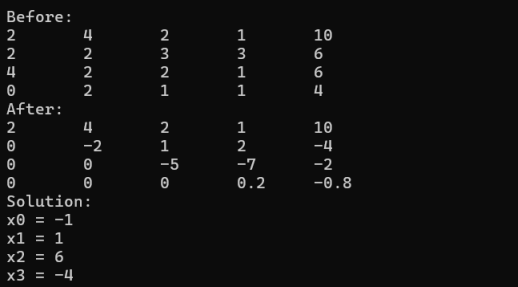
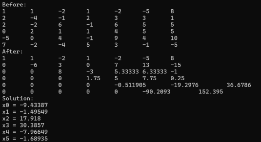

<h3>Lab 03</h3>

Zadanie:

Napisz program, który będzie rozwiązywał układ 𝑛 równań liniowych o 𝑛 niewiadomych
metodą Gaussa. Wymagania:

a) Dane pobierane są z pliku.

b) W przypadku wystąpienia 0 na przekątnej macierzy, program wypisze stosowny 
komunikat.

c) W wyniku działania program wypisuje:

• Macierz rozszerzoną (przed obliczeniami)

• Macierz rozszerzoną (po pierwszym etapie obliczeń – postępowanie proste)

• Rozwiązanie układu równań (𝑥0 − 𝑥𝑛)

W sprawozdaniu zamieścić wyniki rozwiązania układu równań podanego w plikach 
tekstowych: RURL_dane1.txt, RURL_dane2.txt

Poniżej przedstawiono wyniki dla pliku:

a) RURL_dane1.txt

  

b) RURL_dane2.txt

  

