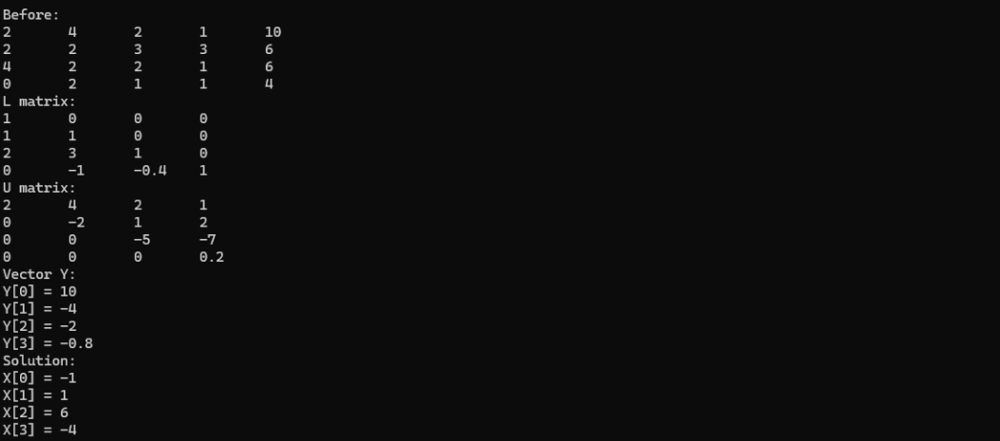
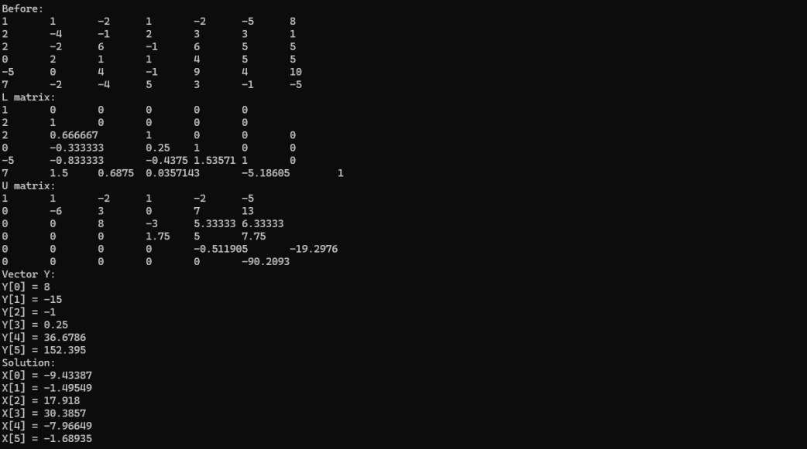

<h3>Lab 05</h3>
Zadanie:

Napisz program, który będzie rozwiązywał układ 𝑛 równań liniowych o 𝑛 niewiadomych 
z zastosowaniem rozkładu LU (algorytm Doolittle’a). 

Wymagania:

a) Dane pobierane są z pliku.

b) W przypadku wystąpienia 0 na przekątnej macierzy, program wypisze stosowny 
komunikat.

c) W wyniku działania program wypisuje:

• Macierz rozszerzoną (przed obliczeniami)

• Macierze 𝐿 i 𝑈

• Wektor 𝑌

• Rozwiązanie układu równań (𝑥0 − 𝑥𝑛)

Poprawność działania programu zweryfikować danymi, które podano w przykładzie wyżej.
Poniżej przedstawiono wyniki dla poszczególnych plików:
- RURL_dane1.txt:

  

- RURL_dane2.txt:

  

