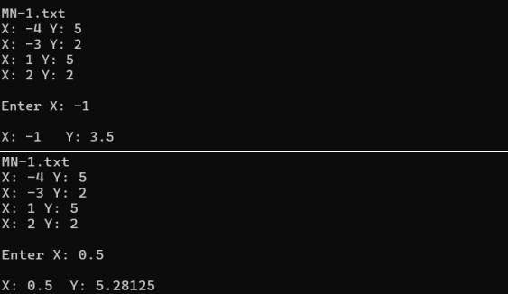

<h3>Lab 01</h3>
Zad 1. Napisz program, który będzie obliczał wartość wielomianu interpolacyjnego Lagrange’a 
w dowolnym punkcie. Założenia:

a) Węzły interpolacji i wartości funkcji w węzłach oraz liczba węzłów są zmiennymi 
pobieranymi z pliku tekstowego.

b) Punkt, w którym obliczamy wartość wielomianu jest parametrem podawanym 
z klawiatury przez użytkownika.

c) W wyniku działania program wypisuje:

• Liczbę węzłów

• Dane: węzły interpolacji i wartości funkcji w węzłach

• Punkt, w którym liczymy wartość wielomianu

• Wartość wielomianu Lagrange’a w danym punkcie

Na UPEL należy przesłać plik *.cpp opracowanego programu oraz wyniki obliczeń 
w formie krótkiego sprawozdania (dodać zrzuty ekranu) dla przykładu przedstawionego
w niniejszej instrukcji. Obliczyć wartość wielomianu dla x = -1 oraz x = 0,5 (7p).

Zad 2. Oblicz wartość [3]√50
za pomocą wielomianu interpolacyjnego Lagrange’a dla funkcji 
𝑦 = [3]√𝑥
i węzłów interpolacji 𝑥0 = 27, 𝑥1 = 64, 𝑥2 = 125, 𝑥3 = 216. W sprawozdaniu opisz 
procedurę obliczania szukanej wartości (3p).
