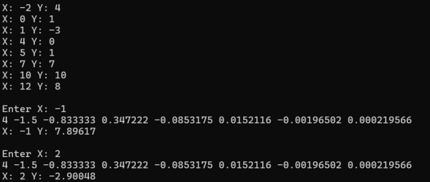

<h3>Lab 02</h3>
Napisz program, który będzie obliczał wartość wielomianu interpolacyjnego Newtona 
w dowolnym punkcie. Założenia:

a) Węzły interpolacji i wartości funkcji w węzłach oraz liczba węzłów są zmiennymi 
pobieranymi z pliku tekstowego.

b) Punkt, w którym obliczamy wartość wielomianu jest parametrem podawanym 
z klawiatury przez użytkownika.

c) W wyniku działania program wypisuje:

• Liczbę węzłów

• Dane: Węzły interpolacji i wartości funkcji w węzłach

• Punkt, w którym liczymy wartość wielomianu

• Wartość wielomianu Newtona w danym punkcie

• Współczynniki wielomianu Newtona (𝑏𝑘)

Obliczyć wartość wielomianu dla x = 2.5 oraz x = 3.5 dla przykładu podanego w instrukcji
(MN-2-p1.txt). Poniżej przedstawiono zrzut ekranu dla pierwszej części zadania:

  

Obliczyć wartość wielomianu dla x = -1 oraz x = 2 dla danych zamieszczonych w pliku 
tekstowym (MN-2-p2.txt). Poniżej przedstawiono zrzut ekranu dla drugiej części zadania:

  

