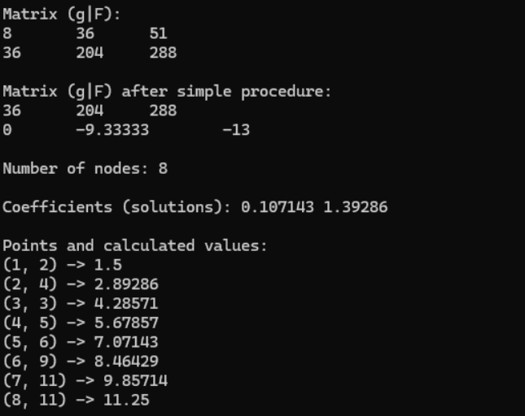
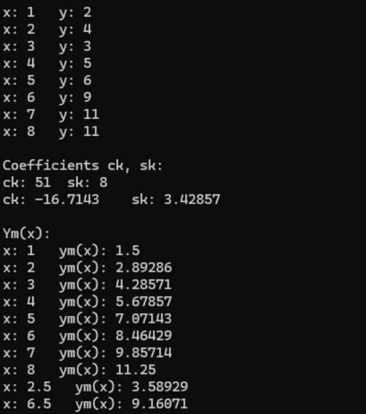
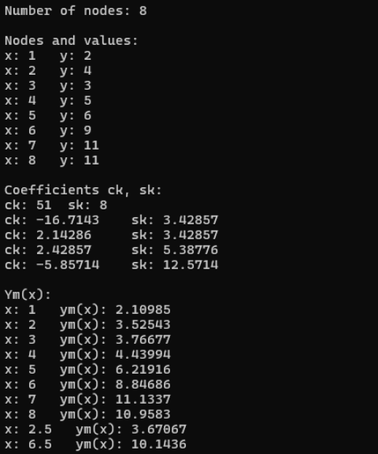
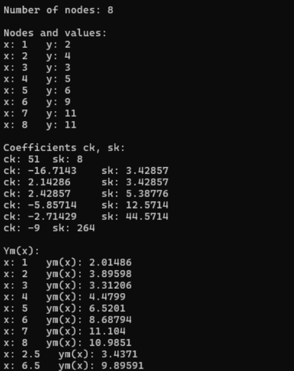

<h3>Lab 09/10</h3>
Zadanie 1

Napisz program, który będzie obliczał współczynniki dla wielomianu aproksymującego
dowolnego stopnia. Wymagania:

a) Stopień wielomianu, liczba węzłów, węzły aproksymacji, wartości aproksymowanej
funkcji i funkcja wagowa są podawane w kodzie programu.

b) Układ równań rozwiązać metodą Gaussa

c) W wyniku działania program wypisuje:

• Liczbę węzłów

• Współczynniki wielomianu aproksymującego

• Podane węzły aproksymacji i wartości w węzłach oraz obliczone wartości
funkcji aproksymującej w węzłach aproksymacji

Przeprowadź aproksymację za pomocą funkcji liniowej dla punktów podanych w przykładzie.
Poniżej zrzut ekranu dla zadania pierwszego:

  

Zadanie 2

Napisz program, który będzie obliczał współczynniki dla wielomianu aproksymującego
dowolnego stopnia. Wymagania:

a) Węzły aproksymacji i wartości w węzłach są wczytywane z pliku tekstowego.

b) W wyniku działania program wypisuje:

• Liczbę węzłów

• Współczynniki 𝑐𝑘, 𝑠𝑘

• Podane węzły aproksymacji (𝑥) i wartości w węzłach (𝑦) oraz obliczone
wartości funkcji aproksymującej 𝑦𝑚(𝑥)

• Wartość funkcji aproksymującej w podanym z klawiatury węźle aproksymacji

Przeprowadź aproksymację za pomocą funkcji liniowej i kwadratowej dla danych: (1, 2),
(2, 4), (3, 3), (4, 5), (5, 6), (6, 9), (7, 11), (8, 11).
Oblicz wartość funkcji dla 𝑥 = 2.5 i 𝑥 = 6.5.
Poniżej przedstawiono zrzuty ekranu z konsoli dla poszczególnych stopni wielomianów:
a) stopień = 1

  

b) stopień = 4

  

c) stopień = 6

  

