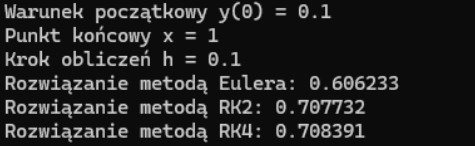
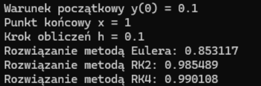

<h3>Lab 13</h3>

Napisz program, który rozwiąże dowolne zagadnienie Cauchy’ego z dowolnym warunkiem
początkowym. Równanie różniczkowe (czyli tak naprawdę funkcję 𝑓(𝑥, 𝑦)) należy
zaimplementować jako odrębną funkcję. Program powinien wyświetlić w konsoli:

1. Warunek początkowy
2. Punkt końcowy
3. Krok obliczeń
4. Rozwiązanie metodą Eulera w punkcie końcowym
5. Rozwiązanie metodą RK2 w punkcie końcowym
6. Rozwiązanie metodą RK4 w punkcie końcowym

Wyznacz rozwiązanie w punkcie 𝑥 = 1 dla 𝑁 = 10 dla następujących równań:

𝑦′(𝑥) = 𝑥^2 + 𝑦, 𝑦(0) = 0.1

Wynik dla powyższego równania:

  

𝑦′(𝑥) = x + 𝑦, 𝑦(0) = 0.1

Wynik dla powyższego równania:

  

