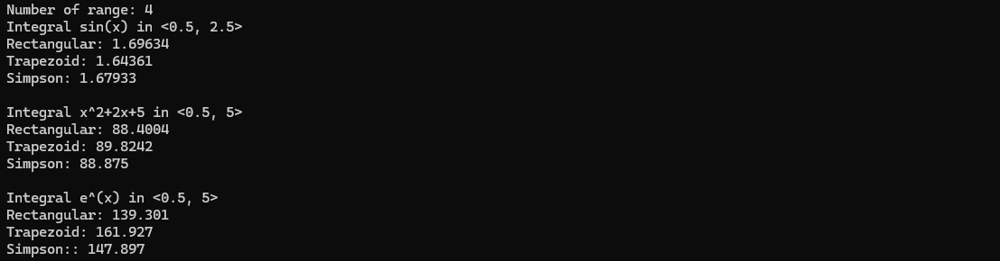
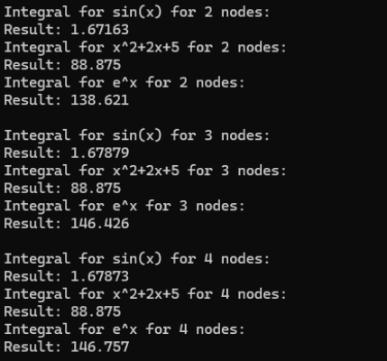
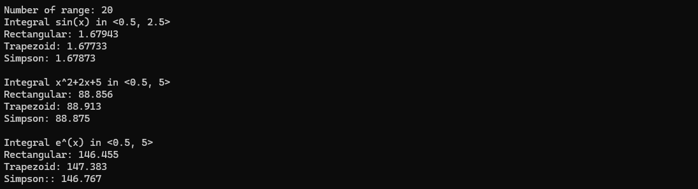
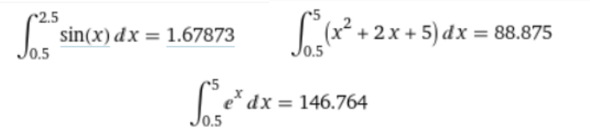

<h3>Lab 07/08</h3>

Zad 1.

Napisz program, który obliczy całkę z dowolnej funkcji podcałkowej za pomocą metody
prostokątów, trapezów i parabol (trzy funkcje). Dostosuj wzór 6 do obliczania całki
w zależności od liczby przedziałów. Funkcja podcałkowa powinna być jednym z argumentów
dla funkcji obliczających wartość całki daną metodą.

Program powinien wyświetlać:

• Wzór całkowanej funkcji

• Przedział całkowania

• Liczbę przedziałów

• Wynik obliczony metodą prostokątów, trapezów i parabol.

Oblicz następujące całki (dla n=4):

• ∫(od 0.5 do 2.5) 𝑠𝑖𝑛(𝑥)𝑑𝑥

• ∫ (od 0.5 do 5)(𝑥2 + 2𝑥 + 5) 𝑑𝑥

• ∫(od 0.5 do 5) 𝑒𝑥𝑝(𝑥) 𝑑𝑥

Poniżej przedstawiono zrzut ekranu przedstawiający wynik dla zadania pierwszego:

Zad 2.

Napisz funkcję, która obliczy całkę z dowolnej funkcji podcałkowej za pomocą metody Gaussa-
Legendre’a dla kwadratury dwu-, trzy- i cztero-węzłowej. Funkcja podcałkowa powinna być
jednym z argumentów dla funkcji obliczających wartość całki. Oblicz następujące całki:

• ∫(od 0.5 do 2.5) 𝑠𝑖𝑛(𝑥)𝑑𝑥

• ∫ (od 0.5 do 5)(𝑥2 + 2𝑥 + 5) 𝑑𝑥

• ∫(od 0.5 do 5) 𝑒𝑥𝑝(𝑥) 𝑑𝑥

Porównaj uzyskane wyniki z metodą prostokątów, trapezów i parabol (dla n=20) oraz
z wynikiem dokładnym.

Poniżej przedstawiono zrzut ekranu przedstawiający wynik dla kwadratur:

Poniżej przedstawiono zrzut ekranu przedstawiający wynik dla metod prostokątów, trapezów i parabol (dla n=20):

Poniżej przedstawiono zrzut ekranu przedstawiający wynik dokładny pobrany ze strony https://www.wolframalpha.com/:

