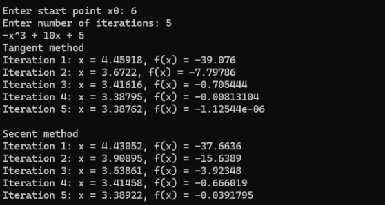
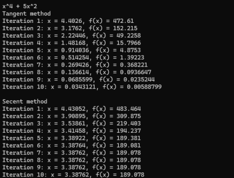
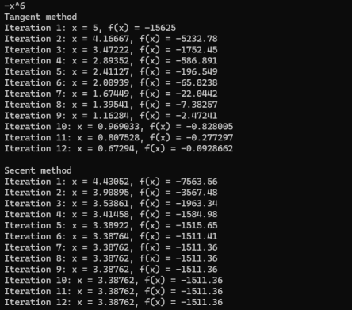
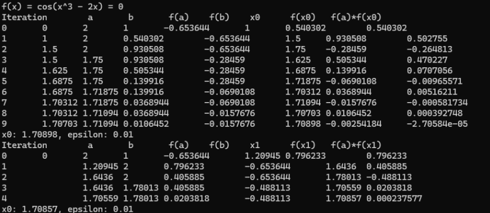
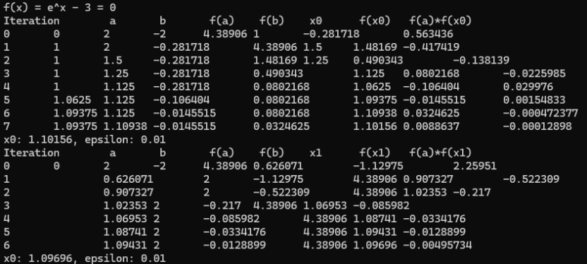

<h3>Lab 11/12</h3>

Zadanie 1.

Napisz program, który rozwiąże dowolne równanie nieliniowe metodą stycznych
i siecznych. 

Wymagania:

• Funkcję 𝑓(𝑥) i pochodną funkcji 𝑓′(𝑥) implementujemy jako odrębne funkcje.

• Pochodną funkcji 𝑓′(𝑥) dla metody stycznych obliczamy analitycznie.

• Użytkownik podaje punkt startowy 𝑥0. Dla metody siecznych przyjąć punkt startowy
𝑥−1 o 0.1 mniejszy od 𝑥0.

• Warunkiem stopu jest podana przez użytkownika liczba iteracji.

• Program powinien wypisać:

o funkcję 𝑓(𝑥) – równanie,

o znalezione rozwiązanie 𝑥 i wartość funkcji 𝑓(𝑥) dla każdej iteracji.

Wykonaj obliczenia dla przykładu podanego w instrukcji (dla 𝑥0 = 6 i dla 5 iteracji) i dla
dwóch dowolnych funkcji wielomianowych. Dla wybranych przez siebie funkcji punkt
startowy i liczbę iteracji przyjmij dowolnie.

Poniżej przedstawiono zrzuty ekranu dla zadania pierwszego:

  
   
  
   
  

Zadanie 2. 

Napisz program, który rozwiąże dowolne równanie nieliniowe metodą bisekcji.
Program powinien wypisać:

o funkcję 𝑓(𝑥) – równanie

Zadanie 3. Napisz program, który rozwiąże dowolne równanie nieliniowe metodą fałszywej linii.

Program powinien wypisać:

o funkcję 𝑓(𝑥) – równanie,

o znalezione rozwiązanie 𝑥 i wartość funkcji 𝑓(𝑥) dla każdej iteracji.

Wykonaj obliczenia dla przykładu podanego w instrukcji i dla dwóch dowolnych funkcji.

Poniżej przedstawiono zrzuty ekranu dla zadania drugiego oraz trzeciego:

  
  
  

